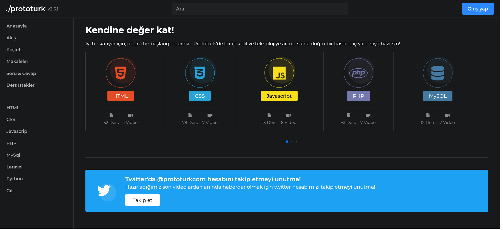

# Prototurk Clone

### [Demo Website](https://prototurk-clone.vercel.app)


## Installation & Setup
If you haven't installed gulpjs first, you can install it .
If you haven't installed gulpjs first, you can install it [here](https://gulpjs.com/docs/en/getting-started/quick-start/).

```
git clone https://github.com/ziarparvaiz/prototurk-clone.git
cd prototurk-clone/src
npm install
gulp
```